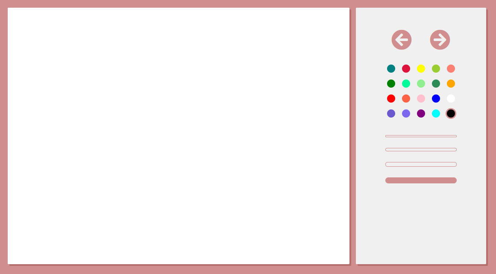
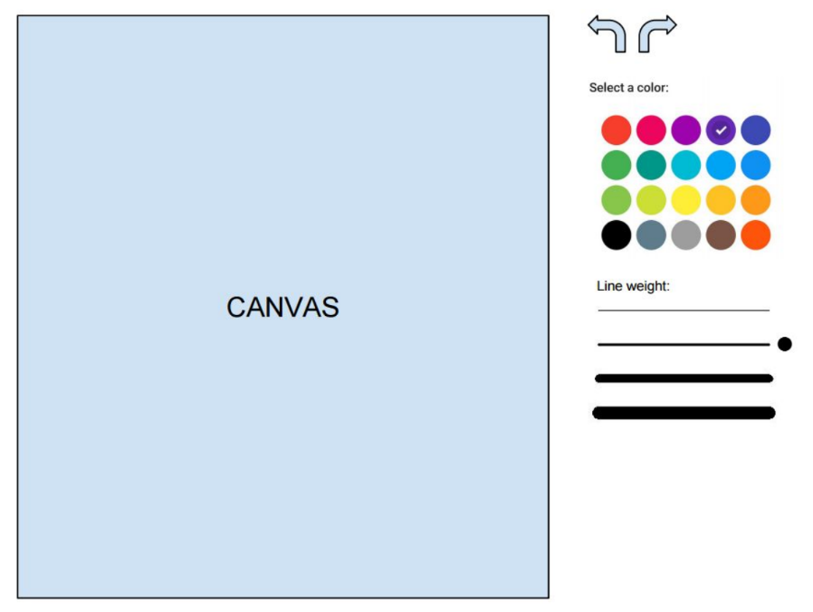

# Paint

### [Documentation](docs/README.md)
### [Live Demo](http://paint-app.surge.sh/)

## Screen Shot



## Getting started

Once in the root foolder of the project.

## Mac
### Run application

```sh
$ open index.html
```

### Run Tests

#### Business Logic tests

```sh
$ open logic.spec.html
```
#### Components tests

```sh
$ open components.spec.html
```
## Windows
### Run application

```sh
$ start index.html
```

### Run Tests

#### Business Logic tests

```sh
$ start logic.spec.html
```
#### Components tests

```sh
$ start components.spec.html
```

## Exercice description

Tienes que hacer una aplicacion parecida al famoso [paint](https://es.wikipedia.org/wiki/Microsoft_Paint) de Microsoft ;). Esta aplicación deberá tener solo las siguientes funcionalidades:
- Deshacer/rehacer
- Selección de color
- Grueso de línea

Aquí tienes un wireframe orientativo de como podrías hacerlo. Puedes modificar el UX como
creas conveniente.



Puedes usar cualquier framework, librería, etc. También puedes hacerlo en Vanilla JS ;)
Con la prueba debes entregar una serie de tests. Puedes usar cualquier setup para estos
(Karma, Jasmine, etc).

## Considerations

Debes proponer la arquitectura a utilizar teniendo en cuenta que el proyecto debería
poderse distribuir como app multidispositivo en un futuro próximo.
La aplicación va a tener un ritmo rápido de iteraciones, incorporando en las próximas
semanas nuevas funcionalidades como filtros, etc.

Se valorarán decisiones de diseño sobre organización de paquetes, componentización,
clean code, seguimiento de principios SOLID, etc.