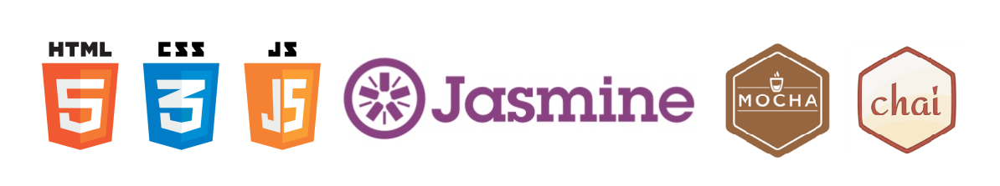
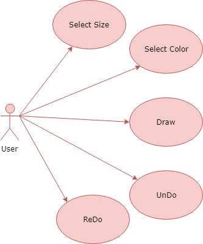

# Documentation

### [Getting Started](../README.md)
### [Live Demo](http://paint-app.surge.sh/)

## Introduction

The **Paint App** inspired in the classic paint from Microsoft but much more minimalist inspires you to give your imagination free rein and let yourself be carried away. It has all the tools you need to have a good time drawing with different colors and sizes.

## Functional description

This application allow users to draw on the browser, with the possibility to change the color and size of the brush. Moreover, it is possible to unDo or reDo your drawn progress.

- [x] Draw.
- [x] Change brush color.
- [x] Change brush size.
- [x] UnDo and ReDo your work.

## Technical description

This is a web application, the current aproach is to work well with desktop users, and it does. But in future versions will be also available for mobie and tablet.

All the components and logic has been done with **VanillaJS**, while for the *logic tests* are handled with **jasmine** and the *components tests* are done with **mocha web and chai**.

On the other hand, the view of the application has been done using **HTML5** and **CSS**. What makes possible to reach the aim of the application is the **Canvas API** which allows us to draw on the screen with javascript.

## Use Cases Diagram

## Authors

Bernat Casasús Vieco - [Github](https://github.com/bcasasus)